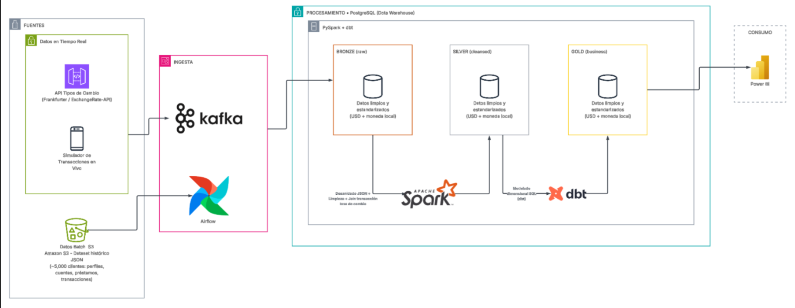
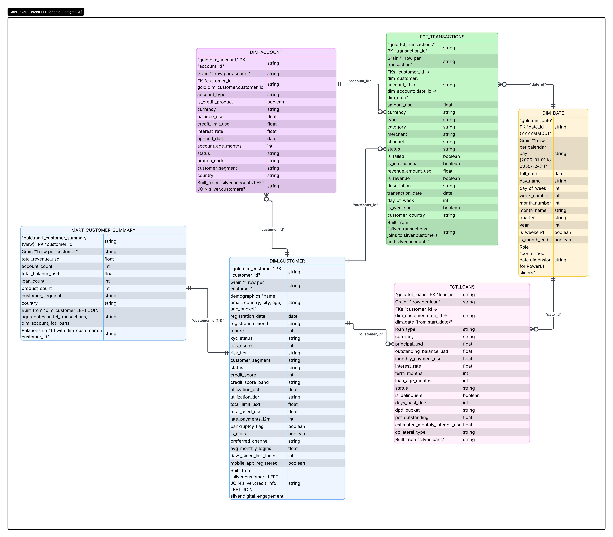
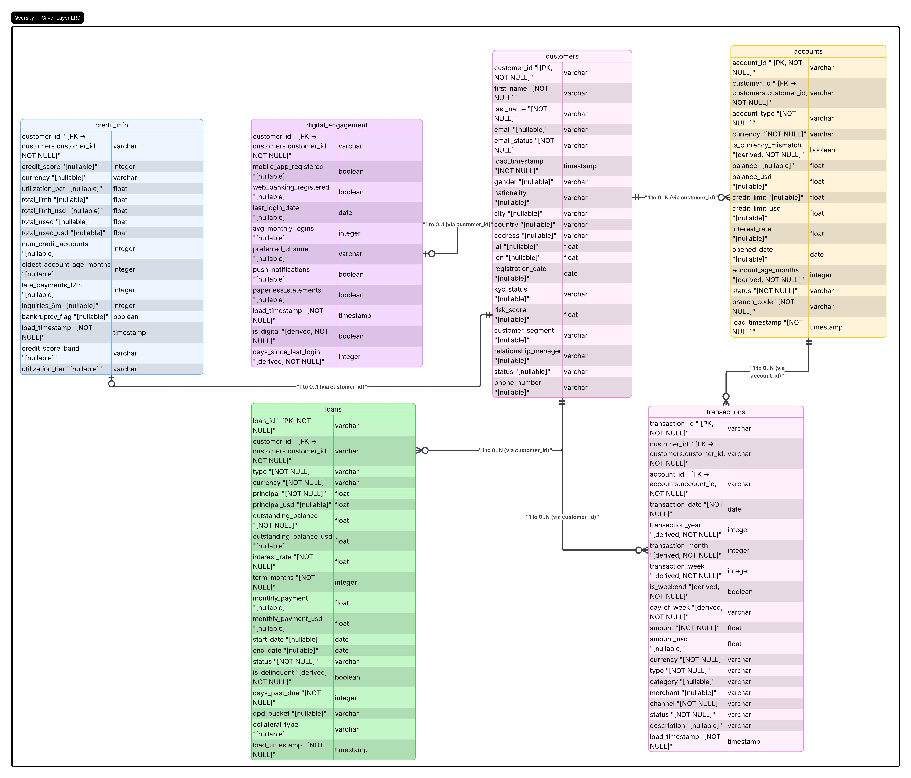

# Payload Analytics

A containerized ELT pipeline for fintech and banking data, built with Airflow, PostgreSQL, PySpark, dbt, and a BI-ready Gold layer. The project is designed to ingest a raw customer dataset from an S3-hosted JSON file, normalize it through Bronze → Silver → Gold stages, and produce analytics tables suitable for reporting and dashboarding.

## Overview



This repository implements a lakehouse-style data pipeline for financial customer records, including customers, accounts, transactions, loans, digital engagement, and credit indicators. The workflow aims to:

- ingest raw JSON records into a Bronze layer
- flatten and deduplicate nested arrays with PySpark
- normalize and clean data in Silver using dbt
- build a reporting-oriented Gold model for analysis and dashboards
- keep business assumptions transparent in the data-model documentation

The raw source is intended to be a public S3 JSON file that is downloaded before loading into Postgres. The download task is prepared in the codebase and currently commented out, but the architecture is already set up for that S3-based ingestion flow.

## Architecture

```text
S3 JSON file → Airflow → Bronze PostgreSQL → PySpark → Silver tables → dbt → Gold tables → BI dashboard
```

### Layers

- Bronze: raw customer JSON stored in PostgreSQL as immutable records
- Silver: flattened, deduplicated, cleaned relational tables
- Gold: star-schema dimensions and facts optimized for reporting

## Project structure

```text
payload-analytics/
├── dags/
│   ├── dag.py                 # Airflow DAG definition
│   └── utils/
│       ├── functions.py       # Bronze schema creation and raw load helpers
│       ├── schema_postgre.py  # Postgres schema definitions
│       └── spark_functions.py # PySpark orchestration helpers
├── spark/
│   ├── bronze_to_silver.py   # PySpark transformation from Bronze to Silver
│   ├── jars/                 # JDBC dependencies for Spark
│   └── schemas/
│       └── spark_schema.py    # JSON schema used to parse nested fields
├── dbt/
│   ├── dbt_project.yml        # dbt project config
│   ├── profiles.yml           # Connection profile for PostgreSQL
│   ├── macros/                # Data cleaning and conversion functions
│   ├── models/
│   │   ├── silver/            # Normalized relational business tables
│   │   └── gold/              # Reporting model, dims, facts, and mart
│   ├── seeds/                 # Reference mappings for currencies, statuses, etc.
│   └── tests/                 # dbt quality checks and custom validation
├── data/
│   └── raw/
│       └── fintech_banking_dataset.json
├── logs/
├── docker-compose.yml         # Container orchestration for Airflow + Postgres + dbt
├── Dockerfile                  # Airflow image with Spark dependencies
├── env.example                 # Environment variable template
├── requirements.txt            # Python dependencies
├── README.md                   # Project documentation
├── readme-example.md           # Reference example used for structure and style
└── .gitignore
```

## Data source and ingestion model

The intended pipeline flow is:

1. download the raw fintech dataset from an S3 URL
2. store it in the local data folder used by the Airflow job
3. insert each JSON record into the Bronze table in PostgreSQL
4. read the raw Bronze records with Spark
5. explode nested arrays and normalize them into Silver tables
6. run dbt for quality checks, standardization, and Gold model creation

The direct S3 download step is currently commented in the DAG and helper functions, which makes it easy to re-enable when the bucket or URL is available. This is intentional: the implementation is prepared for real cloud ingestion without changing the rest of the pipeline design.

## Prerequisites

Before starting the stack, make sure you have:

- Docker and Docker Compose installed
- at least 4 GB of RAM available
- a working local environment with ports 5432 and 8080 available

## Environment configuration

The project uses environment variables defined in `env.example` and supports overriding them through a local `.env` file if needed.

```bash
cp env.example .env
```

Key variables include:

- `POSTGRES_USER`
- `POSTGRES_PASSWORD`
- `POSTGRES_DB`
- `COMPOSE_PROJECT_NAME`
- `RAW_DATA_URL`
- `DBT_CONTAINER_NAME`

The default pipeline setup expects the raw dataset to be pulled from a public S3 URL defined in the Airflow configuration, then loaded into PostgreSQL. If you are using a custom bucket or URL, set `RAW_DATA_URL` in the environment or `.env` file before running the stack.

## Run the project

### 1. Start the containers

```bash
docker compose up -d --build
```

This brings up:

- PostgreSQL
- Airflow
- the dbt service
- the project volume mounts used for Airflow DAGs, Spark scripts, and dbt models

### 2. Access Airflow

Open:

```text
http://localhost:8080
```

Login with:

- username: `admin`
- password: `admin`

### 3. Trigger the pipeline

#### Via Airflow UI

1. Find the DAG named `payload_analytics_fintech_pipeline`
2. Unpause it
3. Trigger it manually from the UI

#### Via command line

```bash
docker compose exec airflow airflow dags unpause payload_analytics_fintech_pipeline
docker compose exec airflow airflow dags trigger payload_analytics_fintech_pipeline
```

### 4. Run dbt manually if needed

```bash
docker compose exec dbt bash
cd /dbt
dbt seed && dbt run && dbt test
```

## Pipeline description

### Bronze layer

The Bronze layer keeps the raw customer documents as immutable records. Each JSON object is stored in PostgreSQL as a full record, preserving nested data structures such as accounts, transactions, loans, credit information, and digital engagement objects.

This layer is meant to act as the audit-friendly source of truth. It does not attempt to clean or standardize values; it records the data as it arrived.

### Silver layer

The Silver layer performs structural transformation and normalization:

- flatten nested arrays into table-level entities
- deduplicate by business key using latest-load logic
- cast raw values into sensible data types
- preserve customer-level extensions such as credit and digital objects in structured form

The PySpark transformation reads Bronze data and writes Silver tables for:

- customers
- accounts
- transactions
- loans

The dbt layer then applies business rules, standardization, and relationships.

### Gold layer

The Gold layer builds reporting-ready models optimized for BI and KPI analysis. It follows a star schema with:

- dimensions: customer, account, date
- facts: transactions and loans
- a customer-summary mart for aggregated portfolio metrics

This stage turns normalized operational data into a dashboard-friendly structure.



## Silver layer data model



## Data quality findings from the dirty source data

The dataset is not clean by default. The project was intentionally designed to handle messy production-style values rather than dropping records silently. Some of the main issues found are summarized below.

### 1. Bad or malformed email addresses

Many email values arrived with formatting inconsistencies, including:

- missing dots in domains
- glued TLD patterns
- stray punctuation or invalid characters
- mixed casing and accent noise

Instead of hard-failing or removing the rows, the cleaning logic keeps the original value when necessary and separates storage from validation. The project distinguishes between:

- a cleaned email value
- an `email_status` flag (`valid` vs `invalid`)

This allows downstream analysis to filter contactable customers without losing the original records for auditing.

### 2. Inconsistent date formats

Dates came in multiple shapes, including:

- `YYYY-MM-DD`
- `YYYYMMDD`
- `DD/MM/YYYY`
- `MM-DD-YYYY`

The date parsing logic standardizes them into a common format and validates conditions such as:

- date of birth before registration date
- no future DOB or registration dates
- no future transaction dates

This avoids broken chronology while retaining the raw data for auditability.

### 3. Currency mismatch and cross-border signals

The source data includes account and transaction currency values that do not always match the expected domestic currency for the customer’s country. For example, a customer in Colombia may have an account or transaction in USD or EUR rather than COP.

Rather than overwriting the original value, the pipeline:

- keeps the recorded currency
- flags mismatch conditions
- converts monetary values to USD for analytics

This makes it easier to analyze international activity, FX exposure, and cross-border customer behavior without losing the native financial context.

### 4. Monetary fields with noise and formatting artifacts

Balances and transaction amounts were not always clean numeric strings. They sometimes contained:

- currency symbols
- letters or locale noise
- extra whitespace
- decimal separators in different formats

The cleaning rules normalize these into a numeric form, while preserving the original currency field and keeping the numeric amount usable for aggregation.

### 5. Boolean and categorical label variation

Values such as status, account types, segments, and digital preferences were inconsistent across the dataset. There were Spanish labels, variants, and spelling deviations. The pipeline uses seed mappings to normalize known categories while leaving unknown values intact instead of forcing them to null.

### 6. Duplicate records from re-ingestion

The source may contain repeated rows for the same entity when a file is reloaded or partially reprocessed. The Spark transformation uses deduplication based on the most recent `load_timestamp` to keep the newest version and avoid duplicate keys in Silver.

## Business assumptions in the model

The project does not try to be perfect by default. Instead, it follows practical assumptions:

- keep rows when a value can be safely normalized
- flag suspicious cases instead of silently deleting them
- preserve the original raw truth in Bronze
- create standardized reporting values in Gold
- use USD as the common reporting scale for cross-country metrics

This approach is especially useful in financial data, where hard deletions can hide real operational patterns and business context.

## Quality checks

The project includes dbt tests for:

- primary key uniqueness
- not-null constraints
- relationships between fact and dimension tables
- accepted values and valid ranges
- transactional date integrity
- customer and revenue consistency rules

These tests validate both the warehouse structure and the business logic used in reporting.

## Typical use cases

This dataset and pipeline are appropriate for:

- customer portfolio analysis
- transaction trend monitoring
- revenue and fee analysis
- account and product mix reporting
- delinquency and risk screening
- international payment and FX exposure analysis

## Evidence


