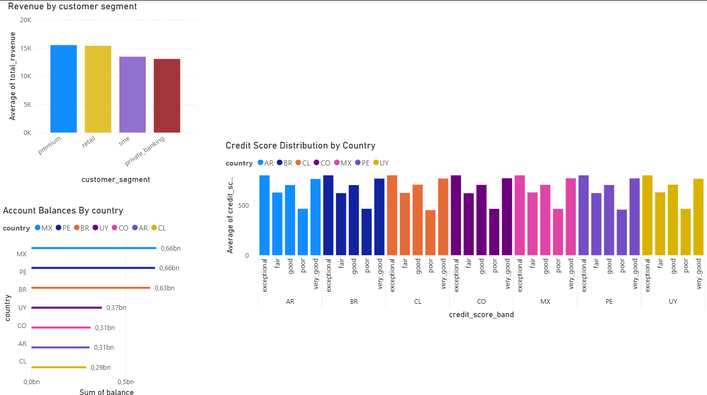

# Qversity v2 — Fintech/Banking Data Engineering Project

A containerized ELT data platform using Docker Compose with Airflow, PostgreSQL, PySpark, dbt, and PowerBI.

## General Architecture

This project implements a Bronze-Silver-Gold data lakehouse architecture for a LATAM Fintech/Banking dataset:

* **Bronze Layer**: Raw JSON ingestion from S3 into PostgreSQL (jsonb)
* **Silver Layer (PySpark)**: Flatten nested arrays and deduplicate data
* **Silver Layer (dbt)**: Clean, standardize, and normalize PySpark output; flatten nested objects
* **Gold Layer (dbt)**: Business-ready analytics and aggregations answering 24 business questions
* **PowerBI**: 4-page dashboard connected to Gold layer tables

```
S3 (JSON) → Airflow → Bronze → PySpark (Silver) → dbt (Silver) → dbt (Gold) → PowerBI

```

## Project Structure

```
qversity-data-2026-medellin-nicolasospina/
├── dags/                     # Airflow DAG definitions
│   └── qversity_dag.py       # Placeholder pipeline DAG
│   └── functions/            # Helper functions for the DAG
├── spark/                    # PySpark scripts and schemas
│   ├── bronze_to_silver.py   # Spark job from bronze to silver
│   ├── jars/                 # JDBC and Spark dependency jars
│   └── schemas/              # Spark JSON schema definitions
├── dbt/                      # dbt project
│   ├── models/
│   │   ├── bronze/           # Raw data staging
│   │   ├── silver/           # Cleaned and normalized data
│   │   └── gold/             # Business analytics
│   ├── tests/                # dbt tests
│   │   ├── silver/           # Custom silver model tests
│   │   └── gold/             # Custom gold model tests
│   ├── macros/               # dbt macros
│   │   └── generic_tests/    # Generic tests for dbt 
│   ├── seeds/                # dbt seeds
│   ├── dbt_project.yml       # dbt configuration
│   └── profiles.yml          # Database connections
├── powerbi/                  # PowerBI deliverables
│   ├── dashboard.pbix        # PowerBI file
│   └── screenshots/          # Dashboard page screenshots
├── data/
│   └── raw/                  # Raw input data
├── imgs/                     # Diagrams images
├── docker-compose.yml        # Docker environment setup
├── env.example               # Environment variables template
├── requirements.txt          # Python dependencies
├── .gitignore
├── .pre-commit-config.yaml   # Code quality hooks
└── README.md                 # This file

```

## Quick Start

### Prerequisites

* Docker and Docker Compose installed
* At least 4GB RAM available
* PowerBI Desktop

### Environment variables (Docker)

Configuration lives in [`docker-compose.yml`](docker-compose.yml). A template is in [`env.example`](env.example). **You can start without a `.env` file** — Compose applies the defaults shown below. Create `.env` only if you need custom credentials or if the Airflow dbt task cannot find the dbt container.

```bash
cp env.example .env   # optional
```

| Variable | Used by | Default (if unset) | Purpose |
|----------|---------|-------------------|---------|
| `COMPOSE_PROJECT_NAME` | Docker Compose | Folder name of the clone | Prefix for container and network names (e.g. `myproject-dbt-1`). |
| `POSTGRES_USER` | postgres, Airflow, PySpark JDBC | `qversity-admin` | Warehouse login. |
| `POSTGRES_PASSWORD` | postgres, Airflow, PySpark JDBC | `qversity-admin` | Warehouse password. |
| `POSTGRES_DB` | postgres, Airflow, PySpark JDBC | `qversity` | Database name (`bronze` / `silver` / `gold` schemas inside). |
| `DBT_CONTAINER_NAME` | Airflow DAG (`dbt_run` task) | `{COMPOSE_PROJECT_NAME}-dbt-1` | Name of the running dbt container for `docker exec … dbt run`. |

**Important — `DBT_CONTAINER_NAME`:** The last pipeline step runs dbt **inside the dbt service** from the Airflow container via `docker exec`. Airflow reads `DBT_CONTAINER_NAME` (set in `docker-compose.yml` from `COMPOSE_PROJECT_NAME`). If you rename the project or clone into a different directory, the dbt container name may change. After `docker compose up`, confirm it:

```bash
docker ps --format "{{.Names}}" | grep dbt
```

If the name differs from what Airflow expects, set both in `.env` so they match:

```env
COMPOSE_PROJECT_NAME=qversity-data-2026-medellin-nicolasospina
DBT_CONTAINER_NAME=qversity-data-2026-medellin-nicolasospina-dbt-1
```

Then recreate containers: `docker compose up -d --build`.

**PySpark / JDBC** (inside the Airflow container, not in `.env` by default): `spark/bronze_to_silver.py` uses `POSTGRES_HOST=postgres`, `POSTGRES_PORT=5432`, and the same `POSTGRES_USER` / `POSTGRES_PASSWORD` / `POSTGRES_DB` as above when connecting from Spark to Bronze/Silver.

**PowerBI / local SQL clients:** host `localhost`, port `5432`, database `qversity`, user/password per your `.env` or defaults.

Other keys in `env.example` (`S3_BUCKET`, `AIRFLOW_UID`, etc.) are reserved for future use; the DAG currently downloads from the public S3 URL hardcoded in `dags/qversity_dag.py`.

### Setup

1. **Clone the repository**:

```bash
git clone https://github.com/niosto/qversity-data-2026-medellin-nicolasospina
cd qversity-data-2026-medellin-nicolasospina

```

2. **Start services**:
With defaults (or after optional `.env` setup above), run:

```bash
docker compose up -d --build

```

### Triggering the Pipeline

Before triggering the pipeline, ensure the DAG is enabled in Airflow.

**Option 1: Via Airflow UI**

1. Access http://localhost:8080 in your browser.
2. Login using `admin` / `admin`.
3. Locate `qversity_fintech_pipeline` in the DAGs list.
4. Toggle the switch to **Unpause** the DAG.
5. Click the **Play** (▶) button to trigger the pipeline.

**Option 2: Via Command Line**

1. Unpause the DAG:

```bash
docker compose exec airflow airflow dags unpause qversity_fintech_pipeline

```

2. Trigger the pipeline:

```bash
docker compose exec airflow airflow dags trigger qversity_fintech_pipeline

```

## Bronze Layer Logic

The Bronze layer serves as the immutable source of truth, capturing raw data exactly as it originates from S3. The pipeline utilizes three distinct tasks to ensure a modular and resilient ingestion process:

1. **download_raw_data**: Fetches the JSON file from the source S3 bucket and saves it to the local `/opt/airflow/data/raw/` directory, which is mapped to your host machine via Docker volumes.
2. **create_schemas**: Ensures the PostgreSQL environment is ready by programmatically verifying or creating the necessary database schemas. This step ensures the pipeline is idempotent.
3. **load_to_postgres**: Uses the `PostgresHook` to parse the JSON file and perform a bulk insert into the `bronze.bronze_fintech_raw` table. Each JSON record is stored as an individual row with a `jsonb` column, a unique identifier, and a `load_timestamp` to maintain full auditability.
4. **dbt_bronze_source_registration (Lineage Only)**: Exposes the raw table as a dbt view (`models/bronze/bronze_raw.sql`). This model acts strictly as a programmatic way for dbt to register and "own" the data at the entry point of the lakehouse, establishing upstream lineage. Because downstream processing is optimized through PySpark, this specific dbt view is a structural abstraction and is not actually executed or queried by the data transformations.

By isolating these tasks, we can easily debug infrastructure issues (like schema creation) separately from data ingestion logic.

### Bronze Table Schema

The Bronze layer materializes as a single PostgreSQL table: `bronze.bronze_fintech_raw`

| Column | Type | Description |
|--------|------|-------------|
| id | SERIAL PRIMARY KEY | Auto-incrementing unique identifier for each record |
| raw_data | JSONB | Complete customer document with full nested structure (not flattened) |
| load_timestamp | TIMESTAMPTZ | UTC timestamp when the record was ingested |

**Expected Record Count**: >= 1,000 customer records

**Raw Data Structure** (stored as JSONB): Each `raw_data` record contains a complete customer document including:
- Flat fields: customer_id, first_name, last_name, email, phone_number, date_of_birth, gender, nationality, city, country, address, lat/lon, registration_date, kyc_status, risk_score, customer_segment, relationship_manager, status
- Nested arrays: `accounts[]` (2-5 per customer), `transactions[]` (5-30 per customer), `loans[]` (0-3 per customer)
- Nested objects: `credit_info{}`, `digital_engagement{}`

## Silver Layer Logic

Silver is a two-phase layer: **PySpark** flattens nested JSON arrays and deduplicates; **dbt** cleans, standardizes, and materializes a **normalized relational model** ready for Gold. In the DAG (`dags/qversity_dag.py`), `spark_bronze_to_silver` runs first, then `dbt seed && dbt run && dbt test`.

```
bronze.bronze_fintech_raw → PySpark (stg_*) → dbt (customers, accounts, …) → Gold
```

### Design choice: normalized ERD

After EDA on the Bronze JSON, I deliberately chose a **normalized ERD** for Silver instead of a single wide denormalized table per customer.

- **One entity = one table** at a stable grain: `customers` (dimension), `accounts` / `transactions` / `loans` (facts), plus `credit_info` and `digital_engagement` (1:1 extensions extracted from nested JSON).
- **Foreign keys** link facts to dimensions (`customer_id`, `account_id`), which enables dbt `relationships` tests and avoids repeating customer attributes on every transaction row.
- **Nested objects** (`credit_info`, `digital_engagement`) are flattened into their own tables rather than left as JSON blobs in the final Silver layer, so analysts and Gold models can join them like any other entity.
- **Denormalization is deferred to Gold**, where marts and dimensions are shaped for PowerBI and the 24 business questions.


### PySpark (`spark/bronze_to_silver.py`)

PySpark handles structural work that is awkward in SQL on nested `jsonb`: explode arrays, cast types, and deduplicate before dbt applies business rules.

1. **Read Bronze via JDBC** — `bronze.bronze_fintech_raw`, one customer document per `raw_data` JSONB row.
2. **Parse & explode** — Spark schema parses JSON; `accounts[]`, `transactions[]`, and `loans[]` become separate DataFrames; `credit_info` and `digital_engagement` remain on the customer row as JSON strings for dbt `::jsonb` extraction.
3. **Staging tables** (schema `silver`):

| Table | Grain | Content |
|-------|-------|---------|
| `stg_customers` | 1 / customer | Flat customer fields + nested objects as JSON |
| `stg_accounts` | 1 / account | From `accounts[]` |
| `stg_transactions` | 1 / transaction | From `transactions[]` |
| `stg_loans` | 1 / loan | From `loans[]` |

4. **Deduplication** — Window by primary key, `load_timestamp DESC`; keep the latest row (`customer_id`, `account_id`, `transaction_id`, `loan_id`). Assumption: re-loads may append duplicates; the newest ingestion wins.
5. **Write** — JDBC `append` to `silver.stg_*` (incremental-friendly if the pipeline is re-run).

### dbt Silver (`dbt/models/silver/`)

| Model | Grain | Role |
|-------|-------|------|
| `customers` | 1 / customer | Core dimension: demographics, contact, tenure, risk/age buckets |
| `credit_info` | 1 / customer (if JSON present) | Credit bureau metrics + score/utilization bands |
| `digital_engagement` | 1 / customer (if JSON present) | Channel registration, preferred channel, `is_digital` |
| `accounts` | 1 / account | Product balances, currency QA flag, USD amounts |
| `transactions` | 1 / transaction | Monetary events, calendar attributes, channel/type |
| `loans` | 1 / loan | Portfolio balances, DPD buckets, delinquency flag |

**Relationships (normalized ERD):**

- `customers.customer_id` → PK on `customers`; FK on `accounts`, `transactions`, `loans`, `credit_info`, `digital_engagement`.
- `accounts.account_id` → PK on `accounts`; FK on `transactions.account_id`.
- Enforced in `dbt/models/silver/silver_schema.yml` via `unique`, `not_null`, and `relationships` tests.

**Build order:** `customers` must build before `accounts` (currency vs country check joins `ref('customers')`). `credit_info` and `digital_engagement` read `stg_customers` and filter `WHERE` the JSON column is not null.

**Macros** (`dbt/macros/`): `format_date`, `clean_amount`, `clean_email`, `email_status`, `match_seed`, `to_usd`, `normalize_null`, `normalize_boolean`, `normalize_phone`, `unaccent`.

**Seeds** (schema `seeds`): fuzzy value maps (`seed_status`, `seed_customer_segment`, `seed_city`, `seed_transaction_type`), `seed_fx_rates`, `seed_currency_map`, `seed_phone_codes`.

### Silver data model (ERD)


The diagram above shows the normalized layout: `customers` at the center, product and event facts on the sides, and 1:1 satellite tables for nested Bronze objects.

### Data quality

| Type | Location | Coverage |
|------|----------|----------|
| Schema tests | `dbt/models/silver/silver_schema.yml` | Unique PKs, not_null, accepted_values, accepted_range, relationships |
| Custom tests | `dbt/tests/silver/` | DOB before registration, no future dates, `is_weekend` vs `transaction_date`, `is_digital` vs `preferred_channel` |

Failed rows from custom tests are queryable failure tables — they document edge cases without silently dropping data.

### Business assumptions (detailed)

These decisions come from EDA on the raw JSON and from patterns observed while building macros and seeds. The goal is to **fix what is safely fixable**, **flag what is suspicious**, and **keep rows** unless a value is structurally unusable (e.g. null credit score outside range).

#### Email cleansing and `email_status`

Raw emails were often malformed — missing dots in the domain, glued TLDs, or stray characters — for example `luis.kol@gmailcomco` or `lolarodrigezhotmail.co`. Fully repairing every variant would require brittle, case-by-case rules.

**Approach:**

1. **`clean_email` macro** — Lowercases and unaccents the string, rebuilds username and domain parts with regex cleanup, and only accepts the repaired address if it still matches a strict pattern (`user@domain.tld`).
2. **`email` column** — Stores the best-effort cleaned address (original kept when repair fails).
3. **`email_status` column** — Added explicitly because validation is separate from storage: `valid` if the cleaned email passes the regex, `invalid` otherwise. Rows are **not dropped**; downstream Gold or BI can filter on `email_status = 'valid'` for contactability KPIs while audits retain invalid cases.

This avoids over-engineering impossible fixes while making data quality visible.

#### Monetary amounts (`clean_amount`)

Balances, transaction amounts, loan principals, and similar fields sometimes arrived as strings with **currency symbols, letters, or locale noise** (e.g. amounts prefixed with `$` while the row already had a `currency` column). Treating `$` as part of the numeric value would double-count currency semantics.

**Assumption:** symbols and alphabetic characters in amount fields are **ingestion/formatting errors**, not business meaning. The `clean_amount` macro:

- Trims whitespace and normalizes decimal separators (`,` → `.`).
- Strips `$`, letters, and spaces via regex before casting to `float`.
- Leaves NULL when the field is empty after normalization.

Original currency remains in the `currency` column; cleaning only affects the numeric magnitude.

#### Multi-currency and USD companion columns

LATAM operations use COP, ARS, MXN, CLP, PEN, BRL, UYU, etc. Summing balances or transaction volumes across countries in local units mixes incompatible scales.

**Assumption:** every monetary fact should be analyzable in **local currency** (source of truth) and in **USD** (cross-country comparison). Static FX rates live in `seed_fx_rates`; the `to_usd` macro multiplies local amount × `usd_per_unit`.

| Model | Local column | USD companion |
|-------|----------------|---------------|
| `accounts` | `balance`, `credit_limit` | `balance_usd`, `credit_limit_usd` |
| `transactions` | `amount` | `amount_usd` |
| `loans` | `principal`, `outstanding_balance`, `monthly_payment` | `principal_usd`, `outstanding_balance_usd`, `monthly_payment_usd` |
| `credit_info` | `total_limit`, `total_used` | `total_limit_usd`, `total_used_usd` |

Rates are fixed for the project scope (not daily market feeds). Gold and PowerBI should prefer `*_usd` columns for regional KPIs unless a question explicitly requires native currency breakdown.

#### Currency vs country (`is_currency_mismatch`)

EDA showed that in **most account rows**, `currency` did not match the **expected currency for the customer's country** (mapping in `seed_currency_map`: e.g. CO → COP, AR → ARS). That pattern is treated as a **cross-border / international banking signal**, not as something to overwrite in Silver.

On `accounts`, `is_currency_mismatch = true` when account `currency` ≠ expected currency for `customers.country`. Rows are retained; the flag supports portfolio and product analysis.

#### Dates

Source dates appear as `YYYY-MM-DD`, `YYYYMMDD`, `DD/MM/YYYY`, `MM-DD-YYYY`, etc. The `format_date` macro picks the parse mask from the string shape. Custom tests enforce: `date_of_birth` before `registration_date`, and no future dates on DOB, registration, or `transaction_date`.

#### Typos and bilingual labels (`match_seed`)

Status, segment, city, and transaction type values include Spanish variants and typos (`activo` → `active`, `pyme` → `sme`). Seeds map fuzzy raw values to canonical English enums; if no seed match exists, the original value passes through so nothing is silently remapped to NULL.

#### Risk, age, and credit bucketing

| Field | Rule |
|-------|------|
| `risk_tier` | &lt;26 low, 26–50 medium, 51–75 high, 76–100 critical |
| `age` / `age_bucket` | Whole years from DOB; buckets 18–25, 26–35, 36–50, 51–65, 65+ (dbt test: age 18–120) |
| `credit_score` | Set to NULL if outside 350–800 (outliers treated as unreliable) |
| `credit_score_band` | FICO-style: poor / fair / good / very_good / exceptional |
| `utilization_tier` | &lt;30% low, ≤60% medium, &gt;60% high |

#### Loans and delinquency

- `dpd_bucket` derived from `days_past_due`: current, 1–30, 31–60, 61–90, 90+.
- `is_delinquent` is `true` only when `status = 'delinquent'` (not `'default'`). Gold delinquency metrics may extend this; Silver documents the stricter flag as implemented.

#### Digital engagement

- `is_digital = true` when `preferred_channel` is `mobile` or `web` (branch/ATM-first customers are non-digital for segmentation).
- Custom test ensures `is_digital` stays consistent with `preferred_channel`.

#### Nulls, booleans, and optional JSON tables

- Empty strings → NULL (`normalize_null`).
- Booleans normalized from `true`/`1`/`yes`/`si` and opposites (`normalize_boolean`).
- `credit_info` and `digital_engagement` only materialize rows where the Bronze JSON object exists; customers without those objects simply have no row in those tables (not a failure).

#### Deduplication (PySpark)

Duplicate primary keys from re-ingestion are resolved by keeping the row with the latest `load_timestamp`. dbt Silver models assume staging is already deduplicated at the entity grain.

## Gold Layer Logic

Gold is built entirely in dbt (`dbt/models/gold/`) on top of the normalized Silver ERD. Models materialize to the PostgreSQL `gold` schema. Silver keeps **correctness and normalization**; Gold adds **reporting grain, business KPIs, and a star-schema layout** aligned with business questions.

```
silver (customers, accounts, transactions, loans, …) → dbt Gold (dims + facts + mart)
```

### Design choice: star schema

After Silver was normalized, I deliberately **denormalized for analytics** using a **star schema**: shared dimensions (`dim_customer`, `dim_account`, `dim_date`) and fact tables (`fct_transactions`, `fct_loans`), plus one **mart** (`mart_customer_summary`) for customer-level KPIs.

**Why star schema (advantages):**

- **BI-native shape** — PowerBI and most self-service tools expect fact tables joined to conformed dimensions; fewer nested joins at report time.
- **Conformed dimensions** — `dim_customer` and `dim_date` are reused across multiple facts, so segment/country/time filters behave consistently on every page of the dashboard.
- **Clear grain** — Each fact has one row per business event (`transaction_id`, `loan_id`); the mart has one row per customer. Metrics are not ambiguous.
- **Separation of concerns** — Silver stays stable for audits and reprocessing; Gold can evolve KPI definitions without rewriting cleansing logic.
- **Testable business rules** — Revenue, delinquency, and international flags live in explicit Gold columns and macros, with dbt tests validating them.

**Trade-offs (conscious compromises):**

- **More joins at query time** — Analysts must join facts to dimensions instead of reading one wide Silver table.
- **Wide `dim_customer`** — Credit and digital attributes are joined into one dimension for convenience (Type 1 denormalization). Updates to credit scores do not version history.
- **Static date spine** — `dim_date` pre-generates 2000–2050 (~18.6k rows). Small storage cost vs. computing calendar attributes on every fact row in every report.
- **USD-only monetary facts in Gold** — Local currency is dropped from fact amounts in favor of `*_usd` from Silver. Cross-country KPIs are consistent; native-currency drill-down requires joining back to Silver.
- **Mart duplication** — `mart_customer_summary` pre-aggregates metrics that could be computed in DAX/SQL at read time; chosen for simpler analytics measures and documented reconciliation tests.

This mirrors the project guidance: Silver = clean relational base; Gold = analytics-ready star schema for BI.

### Gold data model (star schema)


-----


The diagram above shows the star layout: `dim_date`, `dim_customer`, and `dim_account` as conformed dimensions; `fct_transactions` and `fct_loans` as facts; `mart_customer_summary` as a customer-level mart for portfolio KPIs.

### dbt Gold models (`dbt/models/gold/`)

| Model | Type | Materialization | Grain | Role |
|-------|------|-----------------|-------|------|
| `dim_date` | Dimension | table | 1 / calendar day | Date spine with `date_id` (YYYYMMDD integer), calendar attributes, weekend/month-end flags |
| `dim_customer` | Dimension | table | 1 / customer | Customer demographics, risk/segment, credit bureau, digital engagement (joined from Silver satellites) |
| `dim_account` | Dimension | table | 1 / account | Account product attributes; balances and limits in **USD**; customer segment/country for filtering |
| `fct_transactions` | Fact | table | 1 / transaction | Monetary events with revenue and international flags; amounts in **USD** |
| `fct_loans` | Fact | table | 1 / loan | Loan portfolio in **USD** with delinquency and payoff metrics |
| `mart_customer_summary` | Mart | view | 1 / customer | Rolled-up revenue, balances, account/loan counts, product mix |

**Relationships (star schema):**

- `fct_transactions.date_id` → `dim_date.date_id`
- `fct_transactions.customer_id` → `dim_customer.customer_id`
- `fct_transactions.account_id` → `dim_account.account_id`
- `fct_loans.date_id` → `dim_date.date_id` (loan start date)
- `fct_loans.customer_id` → `dim_customer.customer_id`
- `dim_account.customer_id` → `dim_customer.customer_id`
- `mart_customer_summary.customer_id` → `dim_customer.customer_id`

**Macros used in Gold:** `is_international_currency`, `transaction_revenue_amount` (in `dbt/macros/`).

**Build order:** Dimensions first (`dim_date`, `dim_customer`, `dim_account`), then facts (`fct_transactions`, `fct_loans`), then `mart_customer_summary` (view over dims + facts).

### Business assumptions (Gold)

These rules define how KPIs are calculated. They extend — and in some cases **widen** — Silver semantics documented above.

#### Monetary standard (USD)

All amount columns in Gold facts and `dim_account` use **USD** (`amount`, `balance`, `principal`, `revenue_amount`, etc.), sourced from Silver `*_usd` columns via `to_usd` and `seed_fx_rates`.

**Assumption:** regional and executive dashboards compare customers and countries on a **common scale**. Local currency remains in Silver for audit; Gold is the USD reporting layer.

Supported FX codes include LATAM currencies in `seed_fx_rates` plus **EUR** (fixed rate `1.08` USD/EUR) for international accounts and transactions. Silver normalizes currency codes (`normalize_currency` macro maps `EURO` → `EUR`) before conversion.

#### Revenue (`fct_transactions`)

**Definition:** revenue is **fee income only**, and only when the transaction **completed successfully**.

| Column | Rule |
|--------|------|
| `revenue_amount` | `amount_usd` when `type = 'fee'` and `status = 'completed'`; otherwise `0` |
| `is_revenue` | `true` when `revenue_amount > 0` |

Deposits, transfers, withdrawals, and failed/pending fees are **not** revenue. This matches a banking fee-income view, not total payment volume. Implemented in the `transaction_revenue_amount` macro.

`mart_customer_summary.total_revenue` is the **sum of `revenue_amount` per customer** from `fct_transactions`.

#### International transactions (`is_international`)

**Definition:** a transaction is **international** when its **transaction currency** differs from the **expected domestic currency** for the customer's country (`seed_currency_map`: e.g. CO → COP, AR → ARS).

| Column | Rule |
|--------|------|
| `is_international` | `true` when `UPPER(transaction.currency) ≠ expected_currency(country)` |

This is the **transaction-level** counterpart to Silver's account-level `is_currency_mismatch`. A customer in Colombia paying in USD or EUR flags as international even if the account is domestic. Rows are never dropped; the flag supports cross-border payment analysis.

#### Failed transactions (`is_failed`)

| Column | Rule |
|--------|------|
| `is_failed` | `true` when `LOWER(status) = 'failed'` |

Failed transactions remain in the fact table for operational analysis but **do not contribute to revenue**.

#### Loan delinquency (`fct_loans`)

Gold **extends** Silver delinquency semantics:

| Layer | `is_delinquent` rule |
|-------|----------------------|
| Silver `loans` | `true` only when `status = 'delinquent'` |
| Gold `fct_loans` | `true` when `status IN ('delinquent', 'default')` |

**Assumption:** portfolio risk KPIs should treat **defaulted** loans as delinquent, not only actively delinquent ones. PowerBI delinquency rates use Gold `is_delinquent`.

Other loan metrics:

| Column | Rule |
|--------|------|
| `pct_outstanding` | `outstanding_balance / principal` when `principal > 0`, capped at **1.0** (handles FX rounding and near-zero principals) |
| `estimated_monthly_interest` | `outstanding_balance × (interest_rate / 100) / 12` when balance &gt; 0; else `0` |
| `loan_age_months` | Months from `start_date` to `CURRENT_DATE` |
| `date_id` | `start_date` as YYYYMMDD integer → `dim_date` |

#### Credit product flag (`dim_account`)

| Column | Rule |
|--------|------|
| `is_credit_product` | `true` when `account_type = 'credit_card'` |

Used for product-mix and revolving-credit analysis without filtering on raw type strings.

#### Date dimension (`dim_date`)

**Assumption:** all time-based analysis shares one **conformed calendar**. `dim_date` is generated with `generate_series('2000-01-01', '2050-12-31')` — wide enough for historical transactions and forward-dated edge cases in source data.

Facts store `date_id = TO_CHAR(event_date, 'YYYYMMDD')::integer` for efficient joins and PowerBI date relationships. Custom tests verify `date_id` matches the source event date on transactions.

#### Customer mart (`mart_customer_summary`)

One row per customer (all customers from `dim_customer`, including those with zero activity):

| Metric | Definition |
|--------|------------|
| `total_revenue` | Sum of `fct_transactions.revenue_amount` |
| `total_balance` | Sum of `dim_account.balance` (USD) |
| `account_count` | Count of accounts |
| `loan_count` | Count of loans |
| `product_count` | `account_count + loan_count` |

Null aggregates from customers with no transactions/accounts/loans are **coalesced to 0**. Implemented as a **view** so it always reflects current facts without a separate refresh step.

### Data quality (Gold)

| Type | Location | Coverage |
|------|----------|----------|
| Schema tests | `dbt/models/gold/schema.yml` | PKs, FKs, not_null, accepted_range (calendar, `pct_outstanding`), is_non_negative on metrics |
| Custom tests | `dbt/tests/gold/` | Revenue logic, delinquency consistency, transaction `date_id` integrity, mart metric reconciliation |

Gold tests focus on **grain, referential integrity, KPI definitions, and mart rollups** — not on re-validating every Silver `accepted_values` on pass-through columns.

## PowerBI Dashboard

The dashboard (`powerbi/dashboard.pbix`) connects **directly to PostgreSQL** schema **`gold`** and presents all **24 business questions** from across four pages. Screenshots are in `powerbi/screenshots/`.

### Connection settings

| Setting | Value |
|---------|--------|
| Server | `localhost:5432` |
| Database | `qversity` |
| Schema | `gold` |
| Authentication | Database (user/password from `.env` or defaults) |

**Tables loaded:** `dim_customer`, `dim_account`, `dim_date`, `fct_transactions`, `fct_loans`, `mart_customer_summary`.

**Relationships:** star-schema keys — facts → dimensions on `customer_id`, `account_id`, `date_id`; `mart_customer_summary` → `dim_customer` on `customer_id`. Slicers on `country`, `customer_segment`, and date fields filter all pages consistently.

**Deliverables:**

- `powerbi/dashboard.pbix` — live report file
- `powerbi/screenshots/page_1.png` … `page_4.png` — static exports per page

### Page 1 — Revenue, balances & portfolio overview (Q1–Q6)



**What it shows:** Executive-style KPIs for revenue, assets under management, channel mix, loan interest income, delinquency, and credit quality by geography.

| Visual | Question | Gold source |
|--------|----------|-------------|
| Average revenue by segment | **Q1** — Average revenue per customer by segment | `mart_customer_summary.total_revenue` ÷ customers, by `customer_segment` |
| Account balances by country | **Q2** — Total account balances by country | `dim_account.balance` (USD), by `country` |
| Revenue by transaction channel | **Q3** — Revenue breakdown by channel | `fct_transactions.revenue_amount` by `channel` |
| Interest income by loan type | **Q4** — Interest income by loan type | `fct_loans.estimated_monthly_interest` by `loan_type` |
| Delinquency rate by segment | **Q5** — Loan delinquency rate by customer segment | `fct_loans.is_delinquent` vs loan count, joined to segment |
| Credit score by country & band | **Q6** — Credit score distribution by country | `dim_customer.credit_score` / `credit_score_band` by `country` |

**Decisions supported:** Compare segment profitability vs risk; prioritize markets with high balances (MX, PE, BR); see whether fee revenue is channel-dependent; monitor credit quality and delinquency before expanding lending in a segment or country.

---

### Page 2 — Risk, demographics & acquisition (Q7–Q12)


**What it shows:** Credit utilization vs delinquency, loan DPD mix, risk-tier distribution, geographic concentration, age profiles, and registration trends.

| Visual | Question | Gold source |
|--------|----------|-------------|
| Utilization tier vs customer count | **Q7** — Relationship between credit utilization and delinquency | `dim_customer.utilization_tier` with delinquency flag (see DAX below) |
| Days past due by loan type | **Q8** — DPD distribution by loan type | `fct_loans.dpd_bucket` by `loan_type` |
| Risk tier pie | **Q9** — Risk score segmentation | `dim_customer.risk_tier` |
| Customer count by country & city | **Q10** — Customer count by country and city | `dim_customer.country`, `city` |
| Age distribution by segment | **Q11** — Age distribution by customer segment | `dim_customer.age_bucket` by `customer_segment` |
| Acquisition over time | **Q12** — Customer acquisition trend (monthly) | `dim_customer.registration_month` |

**Decisions supported:** The Q7 chart includes the note that utilization alone does not show a strong linear link to delinquency in this dataset — useful for calibrating underwriting rules. Acquisition trends and city-level counts guide marketing and branch planning; risk-tier mix supports capital allocation.

---

### Page 3 — Customer lifecycle & transactions (Q13–Q18)


**What it shows:** Lifecycle and compliance status (active/closed, KYC), transaction category mix, weekly seasonality, channel ticket sizes, and operational failure rates.

| Visual | Question | Gold source |
|--------|----------|-------------|
| Customer status breakdown | **Q13** — Customer status breakdown | `dim_customer.status` |
| KYC status distribution | **Q14** — KYC status distribution | `dim_customer.kyc_status` |
| Categories by volume and value | **Q15** — Most common transaction categories | `fct_transactions.category` — count and sum of `amount` |
| Volume by day of week | **Q16** — Transaction volume by day of week | `fct_transactions` / `dim_date.day_name` |
| Average transaction size by channel | **Q17** — Average transaction size by channel | `fct_transactions.amount` by `channel` |
| Failed transaction rate by channel | **Q18** — Failed transaction rate by channel | `fct_transactions.is_failed` (see DAX below) |

**Decisions supported:** Even ~25% split across statuses and KYC states highlights compliance backlog risk. Category and day-of-week patterns inform staffing and fraud monitoring. Failed-rate parity across channels (~25%) suggests systemic or data-wide behaviour rather than one bad channel — worth investigating in ops.

---

### Page 4 — Products, engagement & cross-border (Q19–Q24)


**What it shows:** International vs domestic payments, mobile adoption, digital vs branch preference by age, account-type mix, loan portfolio composition, and products per customer.

| Visual | Question | Gold source |
|--------|----------|-------------|
| International transfer patterns | **Q19** — International transfer patterns | `fct_transactions.is_international` by `customer_country` |
| Mobile adoption by segment | **Q20** — Mobile app adoption rate by segment | `dim_customer.mobile_app_registered` (see DAX below) |
| Digital vs branch by age | **Q21** — Digital vs branch preference by age group | `dim_customer.is_digital` by `age_bucket` |
| Most popular account types | **Q22** — Most popular account types | `dim_account.account_type` counts |
| Loan portfolio composition | **Q23** — Outstanding balance by type and status | `fct_loans.outstanding_balance` by `loan_type`, `status` |
| Average products by segment | **Q24** — Average products per customer by segment | `mart_customer_summary.product_count` by `customer_segment` |

**Decisions supported:** International volume exceeds domestic in several countries (e.g. PE, MX) — relevant for FX and fee products. ~5 products per customer and balanced account-type mix indicate multi-product penetration; loan charts show how much exposure sits in `current` vs `delinquent`/`default` by product line.

### Coverage summary

All **24 / 24** questions are answered on the dashboard (Q1–Q6 on Page 1, Q7–Q12 on Page 2, Q13–Q18 on Page 3, Q19–Q24 on Page 4).

### Custom DAX measures

Most visuals use standard aggregations (`SUM`, `AVERAGE`, `COUNTROWS`) on Gold columns. Three measures required **explicit DAX** because they involve cross-table logic or ratios at a specific grain:

#### `has_delinquent_loan` (Q7 — utilization vs delinquency)

Flags whether a customer has **any** delinquent/default loan in `fct_loans`, evaluated at `dim_customer` grain so utilization tiers can be compared to delinquency presence:

```dax
has_delinquent_loan =
CALCULATE(
    MAXX('gold fct_loans', 'gold fct_loans'[is_delinquent] * 1),
    FILTER(
        'gold fct_loans',
        'gold fct_loans'[customer_id] = EARLIER('gold dim_customer'[customer_id])
    )
) > 0
```

**Logic:** For each customer row, scan related loans; if any `is_delinquent = TRUE`, return 1. Used with `utilization_tier` to explore Q7 — the dashboard notes there is no strong linear relationship in this dataset.

#### `Failed Rate` (Q18 — failed transaction rate by channel)

Share of transactions that failed, safe against empty denominators:

```dax
Failed Rate =
DIVIDE(
    COUNTROWS(FILTER('gold fct_transactions', 'gold fct_transactions'[is_failed] = TRUE())),
    COUNTROWS('gold fct_transactions')
)
```

**Logic:** Matches Gold definition `is_failed = (status = 'failed')`. Applied per channel in the Page 3 table (Q18).

#### `Mobile App Adoption Rate` (Q20 — mobile adoption by segment)

Share of customers enrolled in mobile banking:

```dax
Mobile App Adoption Rate =
DIVIDE(
    CALCULATE(
        COUNTROWS('gold dim_customer'),
        'gold dim_customer'[mobile_app_registered] = TRUE()
    ),
    COUNTROWS('gold dim_customer'),
    0
)
```

**Logic:** Count of customers with `mobile_app_registered = TRUE` divided by all customers in the current filter context (segment slicer). The third argument `0` avoids divide-by-zero on empty selections.

### Other key measures (implicit / built-in)

| Measure | Typical DAX pattern | Used for |
|---------|----------------------|----------|
| Total revenue | `SUM('gold fct_transactions'[revenue_amount])` | Q1, Q3 |
| Total balance | `SUM('gold dim_account'[balance])` | Q2 |
| Interest income | `SUM('gold fct_loans'[estimated_monthly_interest])` | Q4 |
| Delinquency rate | Delinquent loans ÷ total loans (ratio) | Q5 |
| Avg products | `AVERAGE('gold mart_customer_summary'[product_count])` | Q24 |

These rely on Gold business rules documented in the Gold layer section (USD amounts, revenue = completed fees, Gold `is_delinquent` includes `default`).

---

## Source data

The source dataset is a JSON file from an S3 public bucket:

- **URL**: `https://qversity-raw-public-data.s3.amazonaws.com/fintech_banking_dataset.json`
- **Records**: ~5,000 customers with nested accounts, transactions, loans, credit info, and digital engagement data
- **Countries**: CO, UY, AR, MX, CL, PE, BR

## Git Commit Conventions

This project follows the **Conventional Commits** specification to ensure a clear, readable, and automated-friendly development history. Every commit message follows the structure:

`type(scope): description`

### Commit Types

Used the following types to categorize changes:

* **`feat`**: Adding a new feature (e.g., a new dbt model, Airflow DAG task, or transformation logic).
* **`fix`**: Patching a bug (e.g., correcting null handling in a Silver layer model).
* **`docs`**: Updating documentation (e.g., `README.md`, comments, or technical design docs).
* **`refactor`**: Changing code that neither fixes a bug nor adds a feature (e.g., optimizing SQL queries).
* **`test`**: Adding or updating tests (e.g., dbt tests for data quality).
* **`chore`**: Maintenance tasks (e.g., updating `docker-compose.yml`, environment setup).

### Scope

The `scope` refers to the specific layer or component affected by the change:

* `bronze`, `silver`, `gold` (dbt/data layers)
* `airflow` (orchestration/ingestion)
* `spark` (processing scripts)
* `env` (Docker/infrastructure)

### Examples

* `feat(dbt-silver): implement cast and regex for balance cleaning`
* `fix(dbt-silver): apply coalesce to null gender values`
* `docs(readme): update architecture diagram for bronze layer`
* `chore(release): tag v0.2.0-silver`

## Git Tags (Milestones)

This project uses Git tags to mark stable checkpoints in the data pipeline. Please refer to these specific tags to review the implementation of each architectural layer.

```bash
git tag -a v0.1.0-bronze -m "Bronze layer complete"
git tag -a v0.2.0-silver -m "Silver layer complete"
git tag -a v0.3.0-gold -m "Gold layer complete"
git tag -a v0.4.0-powerbi -m "PowerBI dashboard complete"
git tag -a v1.0.0 -m "Final submission"
```

## Cleanup

```bash
# Stop services
docker compose down

# Remove volumes (deletes all data)
docker compose down -v

# Remove images
docker compose down -v --rmi local
```


## Common Commands

### Airflow
```bash
# View logs
docker compose logs -f airflow

# List DAGs
docker compose exec airflow airflow dags list

# Trigger DAG
docker compose exec airflow airflow dags trigger qversity_fintech_pipeline

# Check DAG run status
docker compose exec airflow airflow dags list-runs -d qversity_fintech_pipeline
```

### PySpark
```bash
# Test PySpark interactively
docker compose exec airflow python -c "from pyspark.sql import SparkSession; print('PySpark OK')"
```

### dbt
```bash
# Enter dbt container
docker compose exec dbt bash

# Run all models
dbt run

# Run specific layer
dbt run --models bronze
dbt run --models silver
dbt run --models gold

# Test data quality
dbt test

# List models
dbt ls --resource-type model
```

### Database Access
```bash
# Connect to PostgreSQL
docker compose exec postgres psql -U qversity-admin -d qversity

# View schemas
\dn

# View tables in a schema
\dt bronze.*
\dt silver.*
\dt gold.*

# Describe a table
\d <schema>.<table_name>
```

## Participant

- **Name**: Nicolás Ospina Torres
- **Email**: nicolasospinat@gmail.com
- **City**: Medellín
- **Cohort**: Qversity 2026
